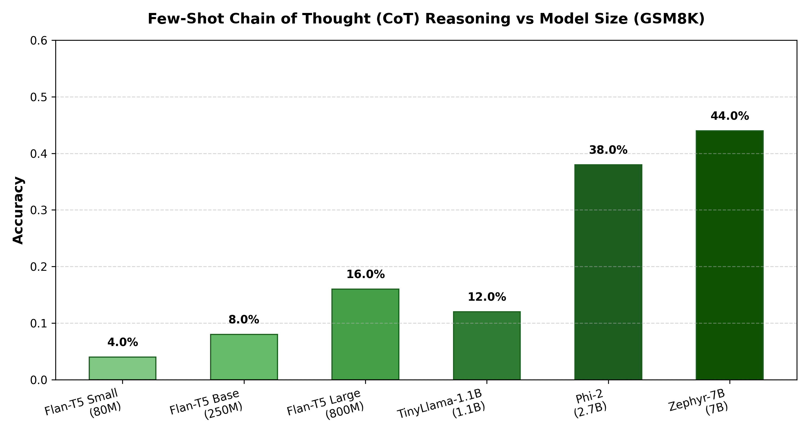
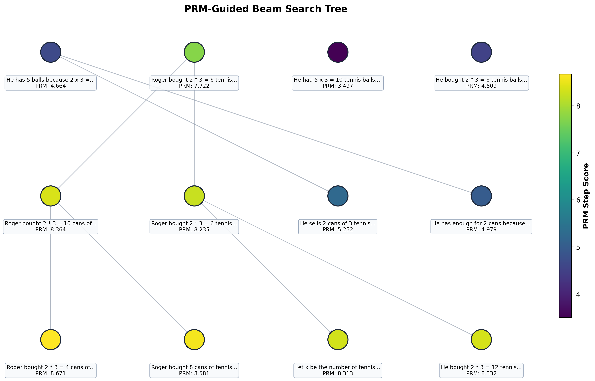

# 🧠 Reasoning for LLMs: Chain of Thought (CoT) Prompting & Model Scaling

An empirical research study and evaluation framework analyzing **Chain of Thought (CoT) Reasoning** performance across model architectures (Seq2Seq & Causal/Decoder LMs) and model sizes ranging from **80M to 7B parameters** on arithmetic reasoning benchmarks (**GSM8K** and **SVAMP**).

---

## 📌 Key Insights & Findings

1. **Emergence with Scale**: Chain-of-Thought reasoning gains meaningful traction primarily as parameter scale exceeds **~1B parameters**. Smaller models (e.g., Flan-T5 80M/250M) struggle with coherent multi-step deduction despite explicit few-shot CoT exemplars.
2. **Intermediate Reasoning Steps**: Providing step-by-step reasoning exemplars guides models to generate intermediate natural language deduction steps before emitting the final numerical answer.
3. **Arithmetic Bottleneck**: Even at 7B parameters (Zephyr-7B, Phi-2), raw arithmetic reasoning without external calculator tools or RL reasoning alignment (e.g., GRPO/PPO) remains vulnerable to calculation errors in multi-hop problems.

---

## 📊 Benchmark Results

| Model Architecture | Parameters | Model Identifier | GSM8K (Few-Shot CoT) |
| :--- | :--- | :--- | :---: |
| **Flan-T5 Small** | 80M | `google/flan-t5-small` | **4.0%** |
| **Flan-T5 Base** | 250M | `google/flan-t5-base` | **8.0%** |
| **Flan-T5 Large** | 800M | `google/flan-t5-large` | **16.0%** |
| **TinyLlama-1.1B** | 1.1B | `TinyLlama/TinyLlama-1.1B-Chat-v1.0` | **12.0%** |
| **Phi-2** | 2.7B | `microsoft/phi-2` | **38.0%** |
| **Zephyr-7B** | 7B | `HuggingFaceH4/zephyr-7b-alpha` | **44.0%** |



---

## 📁 Repository Structure

```
Reasoning for LLM/
├── notebooks/
│   ├── 01_cot_benchmarks/
│   │   └── Reasoning_for_LLMs_CoT.ipynb              # CoT reasoning benchmark evaluation (Flan-T5, TinyLlama, Phi-2, Zephyr-7B)
│   ├── 02_llama3_from_scratch/
│   │   └── Llama3_2_CoT_Reasoning_Inference.ipynb    # Llama-3.2 from scratch with CoT reasoning & inference
│   └── 03_prm_beam_search/
│       └── PRM_Guided_Beam_Search.ipynb              # PRM-guided beam search & step-by-step reasoning tree
├── src/
│   ├── __init__.py
│   ├── config.py                                     # Model registries, hyperparameters, size mappings
│   ├── dataset.py                                    # GSM8K and SVAMP dataset loaders & parsing utilities
│   ├── prompts.py                                    # Few-shot & Zero-shot CoT prompt templates
│   ├── evaluator.py                                  # Seq2Seq and Causal/Decoder evaluation pipelines
│   ├── prm_search.py                                 # Stepwise PRM scoring, beam search tree expansion & plotting
│   └── visualize.py                                  # Charting and benchmark scaling visualizers
├── results/
│   ├── cot_reasoning_benchmark.png                   # Benchmark scaling visualization
│   ├── prm_beam_search_tree.png                      # PRM-guided reasoning search tree graph
│   └── evaluation_summary.json                       # Evaluation metrics and parameters
├── main.py                                           # CLI runner for multi-model benchmark evaluation
├── run_prm_search.py                                 # CLI runner for PRM-guided beam search reasoning
├── requirements.txt                                  # Python dependencies
└── README.md                                         # Documentation and findings
```

---

## 🚀 Quickstart Guide

### 1. Install Dependencies
```bash
pip install -r requirements.txt
```

### 2. Run Benchmark Evaluation
Evaluate Flan-T5 models on GSM8K:
```bash
python main.py --dataset gsm8k --models "Flan-T5 Small" "Flan-T5 Base" --limit 50
```

Evaluate decoder models (requires GPU for 7B):
```bash
python main.py --dataset gsm8k --models "TinyLlama-1.1B" "Phi-2" "Zephyr-7B" --limit 50
```

### 3. Run PRM-Guided Beam Search Reasoning
Run inference-time compute scaling with Process Reward Model (PRM) guided search:
```bash
python run_prm_search.py --reasoning-model google/flan-t5-base --reward-model cross-encoder/ms-marco-MiniLM-L-12-v2 --beams 4 --beam-width 2 --max-steps 2
```

For GPU/CUDA execution with Zephyr-7B & DeBERTa PRM:
```bash
python run_prm_search.py --reasoning-model HuggingFaceH4/zephyr-7b-beta --reward-model OpenAssistant/reward-model-deberta-v3-large --beams 4 --beam-width 2 --max-steps 3
```

---

## 🔬 Methodology & Reasoning Techniques

### 1. Few-Shot Chain-of-Thought (CoT) Prompting
We provide 5 diverse multi-step mathematical problems demonstrating the reasoning trace `Q: ... -> A: [Step-by-step reasoning] The answer is [Number]`.

### 2. Process Reward Model (PRM) Guided Beam Search
- **Inference-Time Compute Scaling**: Rather than sampling a single output autoregressively, the model explores a search tree of reasoning steps.
- **Stepwise Scoring**: At each intermediate deduction step, a reward model evaluates candidate reasoning prefixes and assigns quality scores.
- **Beam Pruning & Tree Expansion**: The top $M$ beams are expanded into $N$ candidate reasoning branches per step, discarding low-quality paths early.
- **Tree Visualization**: The search graph is color-coded by PRM score and mapped with NetworkX.



---

## 📚 References & Acknowledgments
- **Chain-of-Thought Prompting Elicits Reasoning in Large Language Models** (Wei et al., 2022)
- **Let's Verify Step by Step** (Lightman et al., 2023) — Process Supervision & PRMs
- **GSM8K**: Grade School Math 8K dataset (`openai/gsm8k`)
- **SVAMP**: Simple Variations on Arithmetic Math Word Problems (Patel et al., 2021)
- **CoT Benchmark Colab Workspace**: [Google Colab Link](https://colab.research.google.com/drive/1g4O6OkTe0CgaIFbFtSxeKSKUrlzq40Za?usp=sharing)
- **Llama 3.2 CoT Inference Colab Workspace**: [Google Colab Link](https://colab.research.google.com/drive/1iYd3FtD0bjtkDiv-Q6f7i3XZvQsIqOvq?usp=sharing)
- **PRM-Guided Beam Search Colab Workspace**: [Google Colab Link](https://colab.research.google.com/drive/1fGyjluxCp99QCMXPWzT4lcyR2BrA3UEU?usp=sharing)
