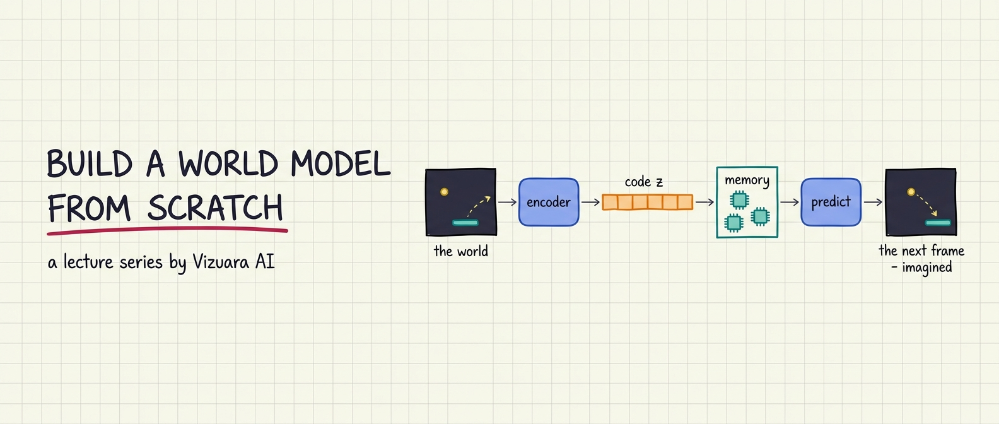
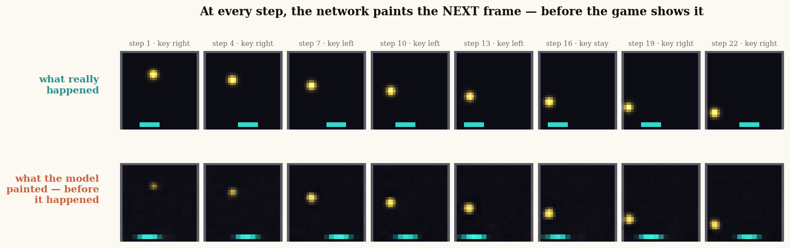
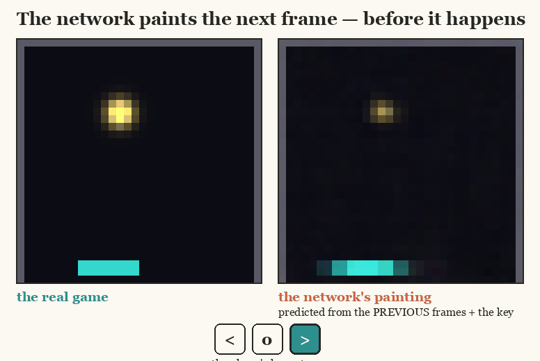
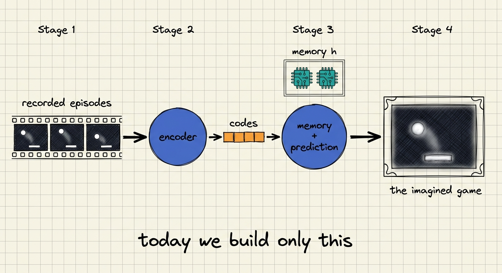
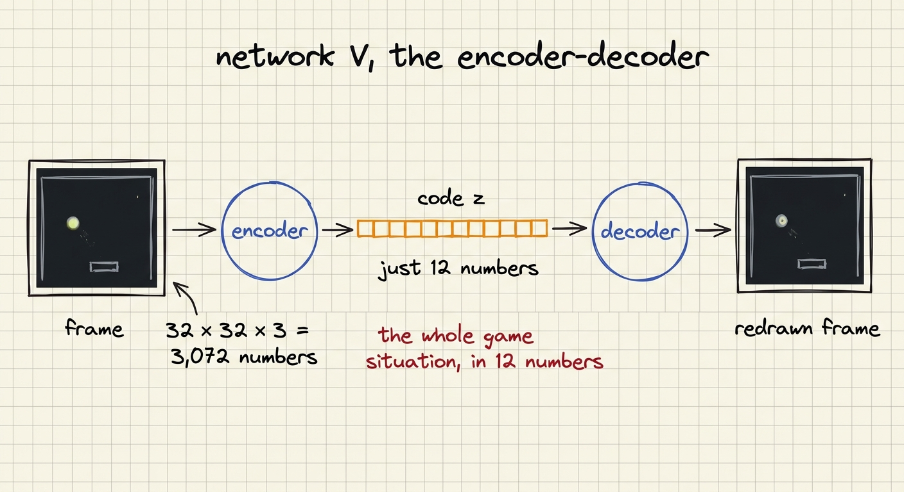
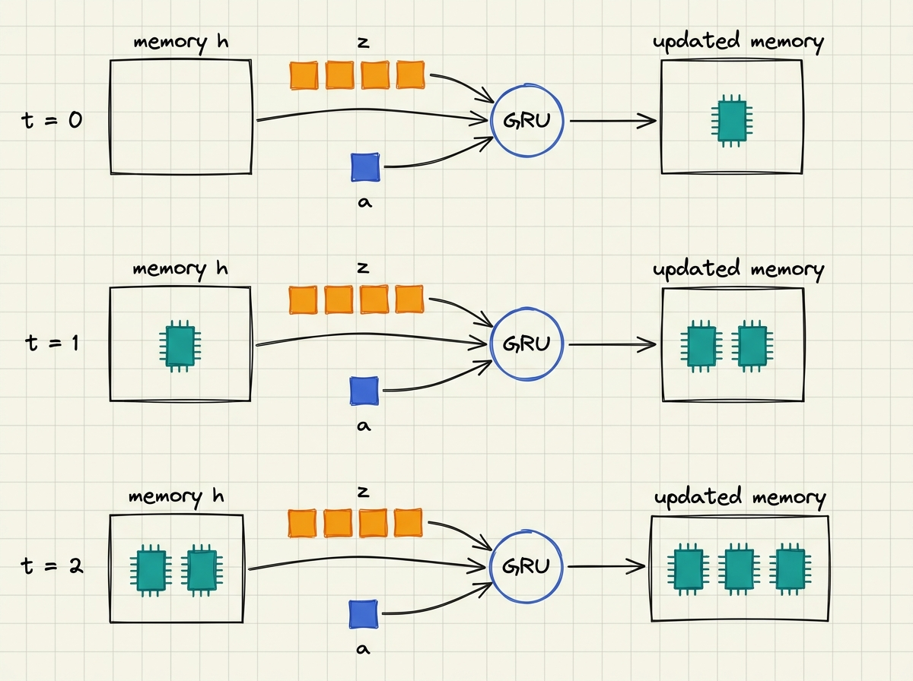
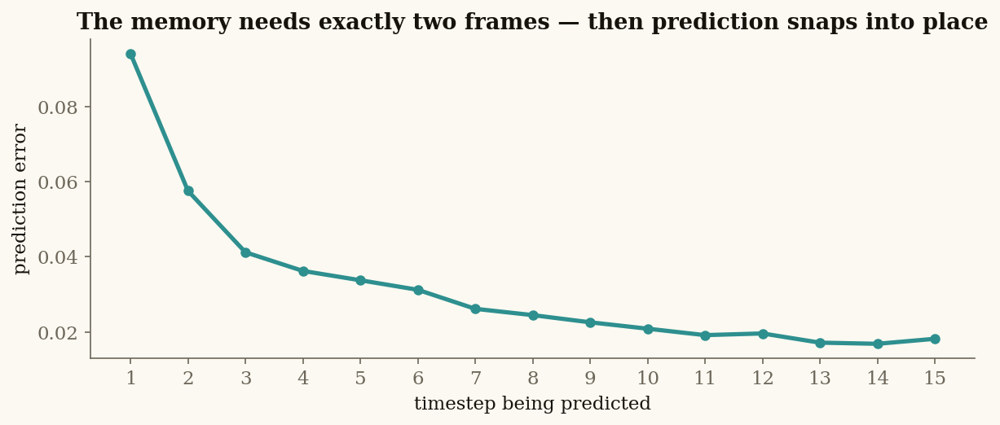
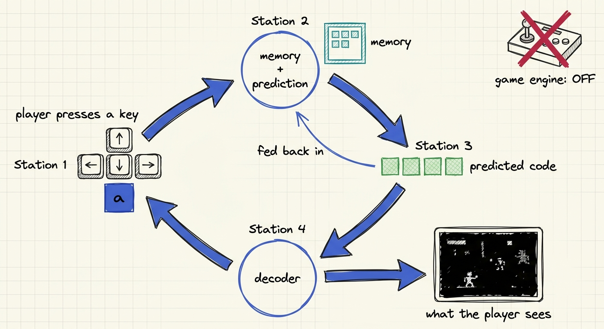

<p align="center">
  
</p>

<h1 align="center">Build a World Model from Scratch</h1>

<p align="center">
  <b>A lecture series by <a href="https://www.vizuara.ai">Vizuara AI</a></b> — slides, runnable code, and Colab notebooks.<br>
  Everything is built from first principles, every number on every slide is real output from the code in this repo.
</p>

<p align="center">
  <a href="https://www.youtube.com/@vizuara"></a>
  <a href="https://colab.research.google.com/github/RajatDandekar/build-a-world-model-from-scratch/blob/main/lecture-03-your-first-world-model/pong_worldmodel.ipynb"></a>
  
  
</p>

---

## What is this?

A world model is a neural network that learns **how a world works** — well enough to predict what
happens next, and eventually well enough that an agent can plan, imagine, and train *inside* the
model instead of the real world. World models sit behind some of the most exciting results in
modern AI: Dreamer agents that learn in imagination, video models that simulate reality, robots
that rehearse before they act.

This series builds that entire idea up **from scratch** — small worlds, small networks, complete
code, honest engineering. No magic, no hand-waving, no "trust us, it works." When something broke
while we built it (and plenty did), the failure and the fix are part of the lecture.

## The lectures so far

| # | Lecture | Materials | What you'll learn |
|---|---------|-----------|-------------------|
| 0 | **Series Introduction** | [slides](lecture-00-series-introduction/lecture-00.pdf) | Why world models, the Renderer/Simulator/Planner map of the field, and where this series goes |
| 1 | **What Is a World Model, Really?** | [slides](lecture-01-what-is-a-world-model/lecture-01.pdf) · [code](lecture-01-what-is-a-world-model/code) | The agent–environment loop, why **state ≠ observation**, 80 years of the idea, and the taxonomy |
| 2 | **The World Modeler's Toolkit** | [slides](lecture-02-the-world-modelers-toolkit/lecture-02.pdf) | The four tools every world model stands on: latent spaces, reward over time, value, actor-critic |
| 3 | **Your First World Model** | [slides](lecture-03-your-first-world-model/lecture-03.pdf) · [notebook](lecture-03-your-first-world-model/pong_worldmodel.ipynb) · [code](lecture-03-your-first-world-model/code) · [VAE companion lecture](https://www.youtube.com/watch?v=VUwAGLM6K_8) | Build a complete world model on MiniPong: encoder + memory + prediction, then run it as the game |

More lectures are on the way — the compounding-error problem that Lecture 3 ends on is exactly
where the story continues (latents built *for* prediction, and eventually agents trained inside
their own dreams).

---

## The headline result (Lecture 3)

Two small networks — **167,527 parameters total, trained in under ten minutes on a laptop CPU** —
learn a Pong-like world from 24,000 recorded frames and nothing else: no labels, no rewards, no
positions, no velocities.

At every step of an episode the model has never seen, it paints **what the next frame will look
like, before the game shows it** — ball position, ball direction, wall bounces, and the paddle's
response to the player's keys, all correct:

<p align="center">
  
</p>

<p align="center">
  
</p>

Run it yourself in one click:
[](https://colab.research.google.com/github/RajatDandekar/build-a-world-model-from-scratch/blob/main/lecture-03-your-first-world-model/pong_worldmodel.ipynb)
— free Colab CPU, ~10 minutes end to end, no installs.

## How the model works

The architecture is the classic **V + M** decomposition from Ha & Schmidhuber's 2018
*World Models* paper, built here in miniature:

<p align="center">
  
</p>

**Network V — the encoder-decoder.** Each 32×32×3 frame (3,072 numbers) is compressed into a
**code z of just 12 numbers**, and decoded back to prove nothing important was lost. Predicting
12 numbers is a far kinder task than predicting 3,072 pixels — this compression is the central
design idea of every world model since.

<p align="center">
  
</p>

> 🎥 **Go deeper on the encoder:** Network V is built on the variational autoencoder idea. For the
> full treatment — the intuition, the math, and a from-scratch implementation — watch Vizuara's
> dedicated lecture: [**Variational Autoencoder (VAE) from scratch | Intuition + Coding**](https://www.youtube.com/watch?v=VUwAGLM6K_8).

**Network M — memory + prediction.** A single frame shows *where* the ball is, never *where it
is going* — velocity lives only in the difference between frames. So M carries a **memory h
(128 numbers) that persists across timesteps**, updated by a GRU at every step. After two frames
the memory holds the difference between two positions. That difference *is* the velocity: no
frame ever showed it, the network derived it, because prediction is impossible without it.

<p align="center">
  
</p>

The proof is measurable. Prediction error is **large at t=1** (velocity is unknowable from one
frame), then **collapses once the memory has seen two frames** — 0.094 → 0.041 by t=3 → 0.021
at t=10 in our run (and in yours, same seed):

<p align="center">
  
</p>

**Deployment — the closed loop.** Switch the game engine off and feed the model's predictions
back in as its own next inputs: the model *becomes* the game. The paddle obeys the player
indefinitely; the imagined ball holds for the first steps, then drifts — tiny errors compound
every time the model eats its own output. **That compounding-error problem is the central open
problem of world models**, and it is precisely where the next lectures pick up.

<p align="center">
  
</p>

## The honest engineering

Every one of these came from a real failure we hit while building this — each is now lecture
material, and each is a lesson that generalizes far beyond Pong:

1. **Compression keeps what the loss pays for.** Our first encoder produced perfect paddles and
   *no ball* — the ball is a handful of pixels, and dropping it cost the loss almost nothing.
   Fix: weight the ball's pixels up. Watch for this failure in every model you ever train.
2. **Normalise the code dimensions.** The big busy paddle dominated the code's variance and the
   loss ignored the ball's quiet dimensions.
3. **Training in open loop and running in closed loop are different sports.** A model with
   near-perfect one-step predictions can still collapse when it eats its own outputs. Practise
   the closed loop during training, and decode predictions back to pixels to keep them honest.
4. **Predict the *change* in the code, not the code.** Under uncertainty, MSE's safest answer
   drifts toward the dataset average — an invisible smeared ball. Predicting changes makes the
   safe answer "nothing moves," which keeps the ball painted.
5. **The world itself must be learnable.** Random ball respawns are unlearnable for a
   deterministic predictor (it predicts the average of all futures — a future that never
   happens), and integer-snapped motion creates isolated islands of codes where predictions
   landing between islands paint nothing. Deterministic physics + smooth sub-pixel motion fixed
   both.

## Running things locally

Everything needs only `numpy`, `torch`, and `matplotlib`:

```bash
# Lecture 1 — partial observability made into a number (runs in ~1 second)
python lecture-01-what-is-a-world-model/code/world_model_lecture1.py

# Lecture 3 — the full world model build (~8 minutes on a laptop CPU)
cd lecture-03-your-first-world-model/code
python pong_worldmodel.py
```

The Lecture 3 notebook ([pong_worldmodel.ipynb](lecture-03-your-first-world-model/pong_worldmodel.ipynb))
is the same code as `code/pong_worldmodel.py`, wrapped in a guided, read-along narrative —
regenerate it any time with `python make_ipynb.py`.

## About

Created by **[Rajat Dandekar](https://www.youtube.com/@vizuara)** (Vizuara AI). The series is
taught on the [Vizuara YouTube channel](https://www.youtube.com/@vizuara) — slides here are the
exact decks used in the recordings, and the hand-drawn "whiteboard notebook" figures throughout
are part of the series' visual language.

If this helped you understand world models, a ⭐ on the repo helps others find it.

*Reference: D. Ha & J. Schmidhuber, ["World Models"](https://arxiv.org/abs/1803.10122), 2018.*
